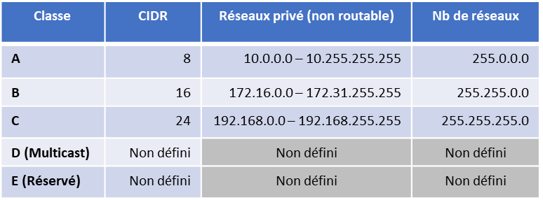

# HTTP - Contournement de filtrage IP
Date: 03/10/2025  
Plateforme:  Root-Me   
Niveau: Très facile

## Outil utilisé :

```markdown
## A remplir !!
   ```


## Énoncé du Labs :

Chers collègues,

Nous avons réussi à gérer les connexions à l’intranet via les adresses IP privées, il ne sera donc plus nécessaire de vous identifier par compte / mot de passe quand vous serez déjà connecté au réseau interne de l’entreprise.

Cordialement,

L’administrateur réseau

## Reconnaissance

###  RFC 1918 

Ma reconnaissance à débuter avec la lecture du document fournie par le challenge. C'est un document de la RFC (Request For Comments) se sont des documents officiels qui décrivent, spécifient ou proposent des standards, protocoles et bonnes pratiques pour Internet et les réseaux informatiques. 

Ici le document était le [RFC 1918 : adresses privées pour réseaux internes](https://repository.root-me.org/RFC/EN%20-%20rfc1918.txt)


Si j'ai bien compris le document parle des bonne pratique en matiere de résaux privée en entreprise pour ne pas saturer les adresses IPv4.

<details>
  <summary><ins> Plus d'explication</summary>

  
Ils ont donc mis en place trois catégorie d'hotes :

- `Catégorie 1 : Les utilisateur interne`, Sans besoin d'acces internet, une machine de production par exemple
- `Catégorie 2 : Les utilisateur avec accès restreint`, ils ont besoin d’accéder à certains services externes ( envoyer des Email, télécherger des fichier etc ...)
- `Catégorie 3 : Les utilisateur avec accès aux résaux internet`.

Les deux première Catégorie sont considerer comme `Privée ` et la troisième catégorie comme `Publique`. Ils ont donc reserver des adresse Ipv4 pour les rendre utilisable uniquement dans les resaux privée. Les `routeurs Internet publics` ignorent les adresses privées se qui permetà à chaque resaux privée d'avoir des adresse IPv4 iddentique tant qu'il ne communique pas entre eux.




</details>

 --- 
###   Catégorie 2 : accès Internet depuis un réseau privé 


---

### Spoofing

---


### Ce que j'ai appris 
- Existance des RCF
- Fonctionnement des résaux privé


---
 ```
2. Enumeration
3. Exploitation
4. Post-exploitation
5. Cleanup

## Détails & commandes
### Reconnaissance
- `commande 1` — but
- `commande 2`

### Enumeration
- Résultats clefs (ports, services, versions)

### Exploitation
- Étapes pour exploiter + commandes
- Payloads / PoCs

### Post-exploitation
- Escalade / mouvements latéraux / preuves (screenshots, flags)

## Résultat
- user.txt / root.txt ou accès obtenu

## Leçons & notes
- Problèmes rencontrés
- Références
```